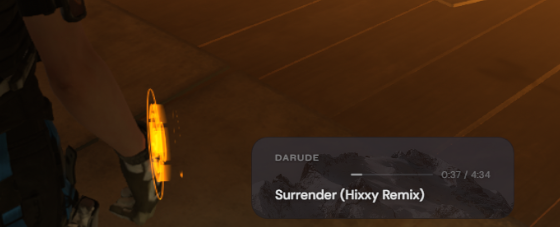

# foobar2000 Now Playing Overlay

A clean, minimal OBS browser source overlay that shows your currently playing track in foobar2000. Displays artist, track title, and a play timer inside a frosted-glass card. Optionally crossfades through a folder of background images on every track change.



---

## Requirements

- [foobar2000](https://www.foobar2000.org/) (any recent version)
- [Beefweb Remote Control](https://github.com/hyperblast/beefweb) — the foobar2000 component that exposes an HTTP API. Install it via foobar's component manager or grab the latest release from GitHub.

---

## Setup

### 1. Beefweb

After installing Beefweb, open foobar2000 and go to **Preferences → Tools → Beefweb Remote Control**. The default port is `8880` — leave it as is unless something else on your machine is already using it. Make sure **Allow remote connections** is checked.

### 2. File structure

Put everything in the same folder, wherever you like:

```
📁 your folder
   nowplaying-overlay.html
   serve.bat
   overlay-server.ps1
   📁 bg
      image1.jpg
      image2.jpg
      ...
```
This folder structure is already correct inside the "Now-Playing-Overlay"-folder in the repo. So all you need to do is extract it wherever you want.
The `bg` folder is optional — if it doesn't exist or is empty, the overlay just shows a plain dark card.

### 3. Start the server

Double-click `serve.bat`. A console window will open confirming it's running. Keep it open while streaming — minimising it is fine.

The server does two things: serves the HTML file to OBS, and proxies API requests to Beefweb. This sidesteps the browser's CORS restrictions that would otherwise block the overlay from talking to foobar.

> **Tip:** Create a shortcut to `serve.bat` in your Start Menu (`C:\Users\[you]\AppData\Roaming\Microsoft\Windows\Start Menu\Programs`) so it's one search away before every stream.  
> **Note:** The local server is the cleanest solution to OBS's CORS restrictions — every browser-based overlay that talks to a localhost API runs into the same wall and solves it the same way. Resource-wise it's negligible, lighter than a Discord notification, so it won't affect your stream performance at all.

### 4. OBS browser source

Add a Browser Source in OBS and point it at:

```
http://localhost:8081/nowplaying-overlay.html
```

Set the background colour to transparent (RGBA 0,0,0,0). Width and height can be whatever fits your layout — the card sizes itself to its content and sits in the top-left corner.

---

## Background images

Drop any images into the `bg` folder — they're picked up automatically, no config needed. On every track change the overlay crossfades to a randomly picked image. Once all images have been shown it reshuffles and starts again.

Supported formats: `jpg`, `jpeg`, `png`, `webp`, `avif`

To disable background images entirely, open `nowplaying-overlay.html` and set:

```js
IMAGES: false,
```

### What looks good

The image sits behind the text at reduced opacity, so busy photos tend to look noisy. What works well:

- Gradient skies — sunsets, golden hour, dusk
- Minimalist landscapes with a strong horizon line
- Abstract or bokeh shots — already soft, very forgiving
- Anything with big areas of solid-ish colour

Avoid heavily detailed photos (dense forests, city skylines at night) unless you're running with blur enabled — they turn into visual noise. [Unsplash](https://unsplash.com) and [Pexels](https://www.pexels.com) are good sources, and both let you filter by colour to match your stream palette.

**Recommended image dimensions:** wide and short — around `1200×300px` or similar. Square and portrait images work but lose a lot to cropping since the card is much wider than it is tall.

---

## Configuration

### JavaScript (`CONFIG` block near the top of the HTML)

| Option | Default | Description |
|--------|---------|-------------|
| `ENDPOINT` | `http://localhost:8081/api/...` | The Beefweb proxy URL. Only change this if you've changed Beefweb's port in its preferences (update `8880` in `overlay-server.ps1` to match). |
| `POLL_MS` | `1000` | How often the overlay checks foobar for updates, in milliseconds. 1000 = once per second. |
| `DEMO_MODE` | `false` | Set to `true` to preview the overlay with fake rotating tracks — useful when foobar isn't running. |
| `IMAGES` | `true` | Set to `false` to disable background images. |

### CSS variables (`:root` block near the top of the HTML)

#### Card shape

| Variable | Default | Description |
|----------|---------|-------------|
| `--card-bg` | `rgba(10,10,14,0.72)` | Background colour of the card. Adjust the last value (0.72) for more or less transparency. |
| `--card-blur` | `28px` | Backdrop blur — the frosted glass effect behind the card. |
| `--card-radius` | `20px` | Corner radius. Higher = rounder. `60px`+ gives a full pill shape. |
| `--card-border` | `rgba(255,255,255,0.07)` | Subtle border around the card. |
| `--card-min-width` | `320px` | Minimum width of the card. |
| `--card-padding-x` | `28px` | Left/right inner padding. |
| `--card-padding-y` | `18px` | Top/bottom inner padding. |

#### Background images

| Variable | Default | Description |
|----------|---------|-------------|
| `--img-opacity` | `0.22` | How visible the background image is. `0.15–0.30` is the sweet spot — below that it's barely there, above it starts competing with the text. |
| `--img-blur` | `0px` | Extra blur applied to the image. `0px` keeps it sharp. Crank it up if you want a softer, more abstract look. |
| `--img-scale` | `1.06` | Slight zoom to prevent blurred edges from peeking through during the crossfade. Only relevant if `--img-blur` is greater than `0`. |

#### Text colours

All text colours are white with varying opacity. Adjust the last value to change intensity.

| Variable | Default | Description |
|----------|---------|-------------|
| `--color-track` | `rgba(255,255,255,0.92)` | Track title — the main text, kept close to full white. |
| `--color-artist` | `rgba(255,255,255,0.42)` | Artist name — intentionally dimmer than the title. |
| `--color-timer` | `rgba(255,255,255,0.35)` | Playback timer — the most subtle of the three. |

#### Text shadows

The shadows are hardcoded in the CSS rather than variables, but they're easy to find and adjust. Search for `text-shadow` in the file — there are three instances (artist, timer, track). The format is:

```css
text-shadow: 0 1px 6px rgba(0,0,0,0.7);
```

The third value is the blur radius (how spread out the shadow is) and the last value is the opacity. Increase the blur radius for a softer glow, or increase the opacity to make text pop more against bright backgrounds.

#### Progress bar

| Variable | Default | Description |
|----------|---------|-------------|
| `--color-bar-bg` | `rgba(255,255,255,0.10)` | The unfilled portion of the progress bar. |
| `--color-bar-fill` | `rgba(255,255,255,0.50)` | The filled portion. |

#### Marquee scrolling

Text that fits inside the card stays still. Text that overflows automatically pans to the end, pauses, then pans back — only the fields that need it scroll, independently of each other.

| Variable | Default | Description |
|----------|---------|-------------|
| `--card-width` | `340px` | Fixed width of the card. Adjust this to fit your layout. |
| `--marquee-speed` | `22s` | Total duration of one scroll cycle. Lower = faster. |

The edge fade that softens text as it scrolls in and out is controlled by this line in the CSS:
```css
mask-image: linear-gradient(to right, transparent 0%, black 1%, black 99%, transparent 100%);
```

The first percentage pair (`0%, 1%`) controls the left fade, the second (`99%, 100%`) controls the right. Set both inner values to `0%` and `100%` respectively to remove the fade entirely.

---

## Behaviour notes

- The overlay hides itself automatically when foobar is closed or nothing is playing.
- A paused track keeps the overlay visible — the timer just stops moving.
- Track title and artist fade out briefly on track change, then fade back in with the new info.
- Background images crossfade over ~0.9 seconds, triggered by track changes.
- If the `bg` folder is empty the overlay works fine, just without images.
- The server (`overlay-server.ps1`) is entirely local — no internet connection involved.

---

## Ports

| Port | Used for |
|------|----------|
| `8880` | Beefweb (foobar2000 API) |
| `8081` | Overlay server (what OBS connects to) |

If either port conflicts with something else on your machine, `8880` can be changed in Beefweb's preferences and `overlay-server.ps1`, and `8081` can be changed in both `overlay-server.ps1` and the `ENDPOINT` value in the HTML.

---

## Disclaimer

This was coded/created Claude AI (Sonnet 4.6). I know frick-all about programming/coding. Just figured to inform that instead of being all like "I made this" when in reality I mostly copy pasted code.