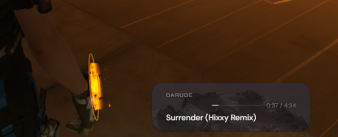
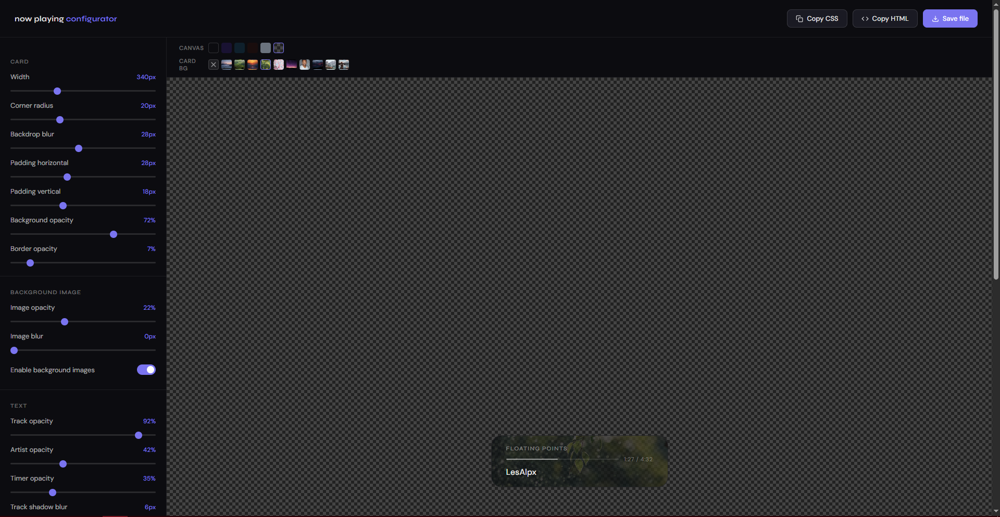

# foobar2000 OBS Overlay

A clean, minimal OBS browser-source overlay that shows your currently playing
**foobar2000** track inside a frosted-glass card with a real-time audio spectrum
visualizer glowing around the border. Optionally crossfades through a folder of
background images on every track change. Comes with a visual configurator.

Everything is served by a **native foobar2000 component** — no external servers,
no Python, no Beefweb. Install the component, point OBS at it, done.

[](https://youtu.be/GIjEJSzIUnQ)

---

## What's included

- **`foo_obs_overlay` component** (`component/`) — serves the overlay page and
  backgrounds over HTTP, now-playing metadata, and a 64-band FFT spectrum over
  WebSocket, all in-process. Servers start and stop with foobar2000.
- **Overlay** (`nowplaying-overlay.html`) — the now-playing card OBS renders.
- **Configurator** (`configurator.html`) — a visual GUI for tweaking every overlay
  setting with a live preview, then exporting a ready-to-use overlay HTML.

---

## Setup

1. Build `foo_obs_overlay.fb2k-component` (see **Building from source** below) or
   grab it from the [Releases](https://github.com/Toni19944/obs-foobar-spotify-overlay/releases)
   page if a component build is attached.
2. Double-click the `.fb2k-component` file (or use foobar2000 → Preferences →
   Components → Install) and let foobar2000 restart.
3. In OBS, add a **Browser Source** pointing at `http://localhost:8081/` with a
   transparent background (RGBA `0,0,0,0`). To hide the card while playback is
   paused, add `?hideWhenPaused=1` to the URL:
   `http://localhost:8081/?hideWhenPaused=1`.

That's it — play a track and the card, backgrounds, and spectrum glow are live.

### Requirements

- **foobar2000 v2.x, 64-bit** — no other components needed.
- [OBS Studio](https://obsproject.com/) (or any tool with a browser source).

---

## Configuration

All runtime settings live in **foobar2000 → Preferences → Tools → OBS Overlay**:

| Setting | Default | Notes |
|---------|---------|-------|
| Overlay (HTTP) port | `8081` | what OBS connects to |
| Spectrum (WebSocket) port | `9001` | visualizer data |
| Background folder | `<profile>\foo_obs_overlay\bg` | default images are extracted here on first run — add/remove your own freely |
| Spectrum timing offset | `0 ms` | ±500 ms; shift the spectrum earlier/later if your audio chain adds delay |

Apply restarts the servers on the spot — no foobar2000 restart needed.

### Browser-source URL flags

The overlay page itself understands a few query parameters:

| Flag | Example | Effect |
|------|---------|--------|
| `hideWhenPaused=1` | `http://localhost:8081/?hideWhenPaused=1` | hide the card while playback is paused |
| `port=<n>` | `http://localhost:9080/?port=9080` | tell the page which overlay port to poll — **required if you changed the overlay port** in Preferences (the page's internal default is 8081) |
| `spectrumPort=<n>` | `http://localhost:8081/?spectrumPort=9500` | same for the spectrum WebSocket — **required if you changed the spectrum port** (internal default 9001) |
| `cardWidth=<px>` | `?cardWidth=480` | card width in pixels (default `340`) |
| `cardHeight=<px>` | `?cardHeight=200` | card height in pixels (default: auto, sized to content) — unlike the configurator's slider, `0` here is literal `0px` (a collapsed, invisible card), not "auto"; omit the flag entirely for auto sizing |
| `cardOpacity=<0-1>` | `?cardOpacity=0.6` | card background opacity (default `0.97`) |
| `imgOpacity=<0-1>` | `?imgOpacity=0.5` | background image opacity (default `0.24`) |
| `bgMotion=1\|0` | `?bgMotion=1` | force background FFT motion on/off (default off) |
| `bgMotionTarget=backdrop` | `?bgMotion=1&bgMotionTarget=backdrop` | redirect bgMotion's audio-reactive pulse from the background image to the card's glass blur instead — mutually exclusive with image motion (never both at once); auto-enables the card's backdrop blur; default (omitted) is `image`, today's unchanged behavior |

Flags combine with `&`, e.g.
`http://localhost:9080/?port=9080&spectrumPort=9500&hideWhenPaused=1`.

None of these are range-checked — an out-of-range value just renders however
it renders, so feel free to push `cardWidth` past what the configurator's
slider allows.

**`bgMotionTarget=backdrop`** trades the background-image motion for a
frosted-glass blur on the card itself that pulses with the same audio
(omit `bgMotion=1` and the blur is simply enabled, static) — useful if you
want an audio-reactive look without animating the background image and the
card's glass blur at the same time (the two are mutually exclusive per
frame, so you only ever pay for one).

**Per-scene setups:** because these are plain URL flags, you can point two
different OBS browser sources at the same overlay URL with different query
strings — e.g. your normal gaming scene with no flags, and a BRB/intermission
scene at `?cardWidth=560&cardOpacity=0.5&bgMotion=1` — without maintaining a
second overlay file or a second component build.

### Changing the overlay's look

The component serves `nowplaying-overlay.html` from memory — the page is embedded
into the DLL at build time, byte-for-byte. That means **look changes require a
rebuild**:

1. Open **`configurator.html`** in any browser, tweak the card shape, colours,
   glow, blur, etc. with live preview, and export the overlay HTML — or edit the
   `CONFIG` and `:root` CSS-variable blocks near the top of
   `nowplaying-overlay.html` directly.
2. Save/overwrite the repo-root `nowplaying-overlay.html` with the result.
3. Rebuild the component (see below) and reinstall the `.fb2k-component`.

**Exporting from the configurator drops the URL flags:** the export template
doesn't include the `applyRuntimeOverrides()` block described under
"Browser-source URL flags" above, so a freshly-exported `nowplaying-overlay.html`
silently ignores every query-string flag. Manually copy that block back into
the exported file before saving it over the repo-root copy. For
`bgMotionTarget`, copying back the override block alone isn't enough: the
configurator's own exported `CONFIG`/`bgAnimate` template has no
`BG_MOTION_TARGET`/`BACKDROP_BLUR_PULSE` keys or backdrop-pulse branch, so
`bgMotionTarget=backdrop` on such a file just flips on `CARD_BACKDROP_BLUR`
with nothing to animate it — you'd also need to copy in those CONFIG keys
and the updated `bgAnimate` function from the repo-root overlay.

No rebuild is needed for: ports, background folder, timing offset (Preferences),
or URL flags that your currently-installed component build already
understands, like `?hideWhenPaused=1` — a flag new to the repo (not yet in
an installed build) still needs the same rebuild-and-reinstall cycle
described above before it does anything. The background images themselves
also need no rebuild — the bg folder is read live, add/remove images
anytime.



---

## Building from source

Needs Visual Studio 2022+ Build Tools (C++ x64 workload) — CMake and Ninja are
included with them.

```
"C:\Program Files (x86)\Microsoft Visual Studio\<ver>\BuildTools\VC\Auxiliary\Build\vcvars64.bat"
cmake -S component -B component/build -G Ninja -DCMAKE_BUILD_TYPE=Release
cmake --build component/build
```

Output: `component/build/foo_obs_overlay.fb2k-component` (and the raw DLL).
The build embeds `nowplaying-overlay.html` and `bg/` byte-for-byte, so overlay
edits require a rebuild to ship inside the component.

The DSP parity test (compares the component's spectrum pipeline against the
captured legacy reference) runs with:

```
component/build/oracle_runner.exe tests/parity/reference/reference.wav tests/parity/reference/reference.jsonl
```

---

## Spotify / desktop app version

Spotify support and the standalone desktop app (bundled exe, no foobar2000
required) live in the **v0.1.1** line, preserved in full:

- The [`v0.1.1` release](https://github.com/Toni19944/obs-foobar-spotify-overlay/releases/tag/v0.1.1)
  has the last prebuilt app (`FoobarOverlay-v0.1.1-win64.zip`) and matching source.
- The [`archive/exe-bundle`](https://github.com/Toni19944/obs-foobar-spotify-overlay/tree/archive/exe-bundle)
  branch is the same tree browsable on GitHub — build instructions in its
  `BUILD.md` (Python 3.12 + PyInstaller), Spotify overlay under
  `Now-Playing-Spotify/`, exe tooling under `launcher/` and `packaging/`.

The exe line runs the older external-server stack and is kept as-is; new
development happens on the foobar2000 component.

---

## License

[GPL-3.0](LICENSE).
